# SPFx Fantastic 40 Web Parts


This package is a sample kit of 40 great Client Side Web Parts built on the SharePoint Framework SPFx.
You can find here different kind of high visual web parts as carousel, images galleries, custom editors, polls, charts, map, animations, etc.
These WebParts are mainly based on best-class jQuery, React or Angular plugins and use the [sp-client-custom-fields library](https://github.com/OlivierCC/sp-client-custom-fields) to optimize the edit experience.
And Yes, these web parts are free and open source, so have fun well to build effective SharePoint site.

These webparts are available: **English, French, Spanish, German**.

**IMPORTANT NOTE: These web parts are not officially supported by Microsoft. Please use the "Issues" tab on this site to report bug or requests for development.**

**Current Version**: v1.0.4 - [Click here to download and install](https://github.com/OlivierCC/spfx-40-fantastics/wiki/Installation-process)

**Current SPFx Release support** -  - [Release Note](https://github.com/SharePoint/sp-dev-docs/wiki/Release-Notes-GA)

For any question, you can also [read the FAQ](https://github.com/OlivierCC/spfx-40-fantastics/wiki/FAQ).

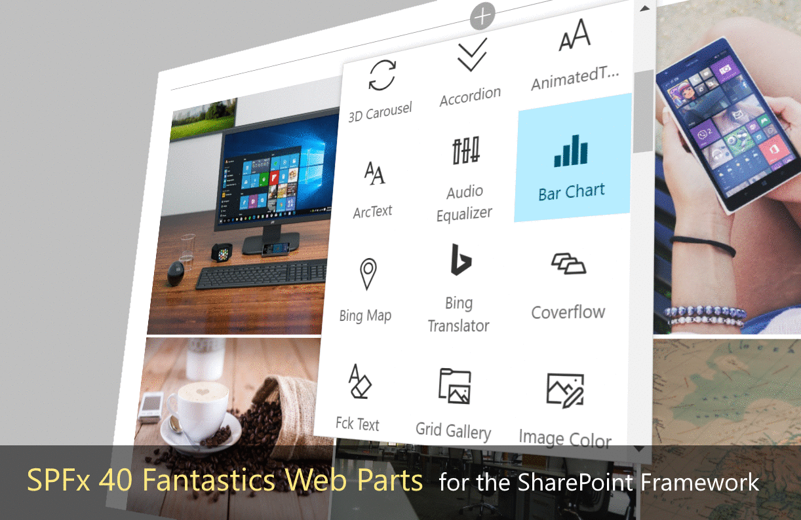

## Menu & Carousels & News Management

Overview |  Web Part |  Description
------------ | ----------- | -----------
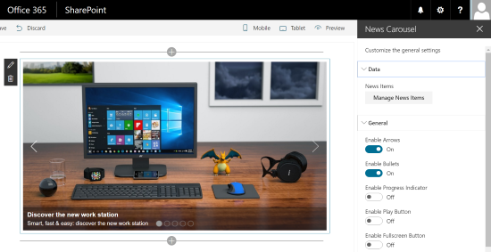 | [**News Carousel**](https://github.com/OlivierCC/spfx-40-fantastics/wiki/News-Carousel) | Insert a classical, responsive, cool & touch ready News Carousel. With this web part, you can add easily news focus in your SharePoint site. The users can easily navigate in news items, with buttons or with touch.
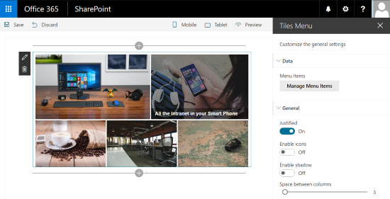 | [**Tiles Menu**](https://github.com/OlivierCC/spfx-40-fantastics/wiki/Tiles-Menu) | This Web Part allows you to very easily create a menu in form of tiles that is responsive and adapted for mobile. You can directly manage the items on your menu, with a title, an image and manage Visual rendering options.
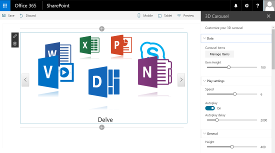 | [**3D Carousel**](https://github.com/OlivierCC/spfx-40-fantastics/wiki/3D-Carousel) | Insert a 3D Carousel in your SharePoint pages. With this Web Part, you can manage your menu items and create automatically a 3D carousel.
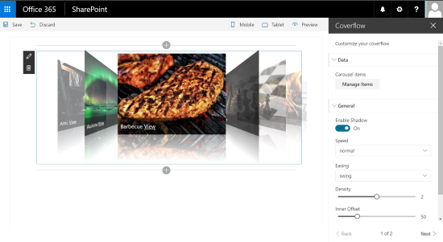 | [**Coverflow**](https://github.com/OlivierCC/spfx-40-fantastics/wiki/Coverflow) | Generates a Coverflow Apple like menu in your pages. Manage your menu items with title and picture and create a cool coverflow menu.
 | [**News Slider**](https://github.com/OlivierCC/spfx-40-fantastics/wiki/News-Slider) | Insert a News Slider Tiles control to your pages. In a few clicks you can create a slider with buttons allowing you to navigate horizontally in tiles. You can define your elements and customize the look and feel of your slider. This Web Part is responsive.
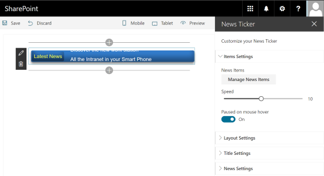 | [**News Ticker**](https://github.com/OlivierCC/spfx-40-fantastics/wiki/News-Ticker) | Insert a simple horizontal News Ticker to display news as a simple ribbon. This web part is usefull if you want to display Breaking News BBC like information in your site

## Social Tools

Overview |  Web Part |  Description
------------ | ----------- | -----------
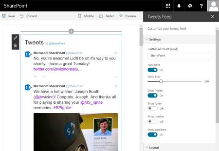 | [**Tweets Feed**](https://github.com/OlivierCC/spfx-40-fantastics/wiki/Tweets-Feed) |  With this Web Part, you can easily add a Twitter feed to any page. You have to specify the Twitter account you want to view messages, configure the Visual rendering, and twitter will be integrated into your site.
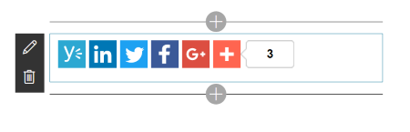 | [**Social Share**](https://github.com/OlivierCC/spfx-40-fantastics/wiki/Social-Share) |  A web part to insert social share buttons as Yammer, Linkedin, Twitter, Facebook and more than 100 other social providers thanks to the Addthis services.
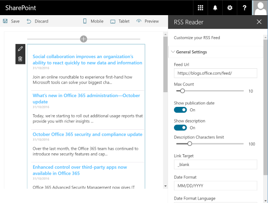 | [**RSS Reader**](https://github.com/OlivierCC/spfx-40-fantastics/wiki/Rss-Reader) |  A web part to insert a full client side RSS/Atom Feed in your SharePoint pages. You can easily integrated a topical or competitive intelligence stream into your pages to your favorite RSS feeds.
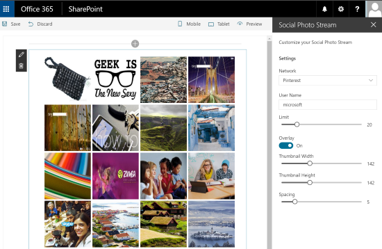 | [**Social Photo Stream**](https://github.com/OlivierCC/spfx-40-fantastics/wiki/Social-Photo-Stream) |  A web part to insert a list of photo from populars photos sharing plateforms as Instagram, Pinterest, Flickr, Deviantart, Dribbble, & Picasa.

## Maps, Charts & Graphs

Overview |  Web Part |  Description
------------ | ----------- | -----------
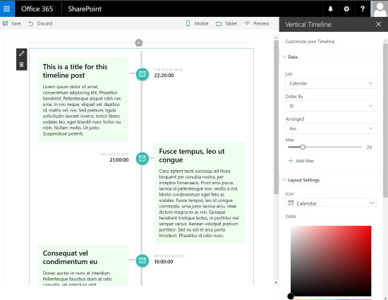 | [**Vertical Timeline**](https://github.com/OlivierCC/spfx-40-fantastics/wiki/Vertical-Timeline) |  A web part to generate a Facebook like vertical Timeline from SharePoint Calendar list items. For example, this Web Part is very convenient to build a synthetic view on your major project milestones. This Web Part uses CSS3 to optimize the user experience.
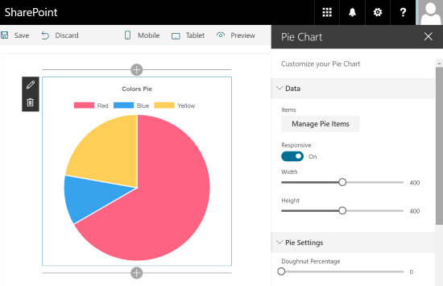 | [**Pie Chart**](https://github.com/OlivierCC/spfx-40-fantastics/wiki/Pie-Chart) |  Insert a Pie chart with a few clicks in your SharePoint page. You can edit the data, choose values, colors, legends and all the graphics. You can generate graphs to fixed sizes or responsive mode.
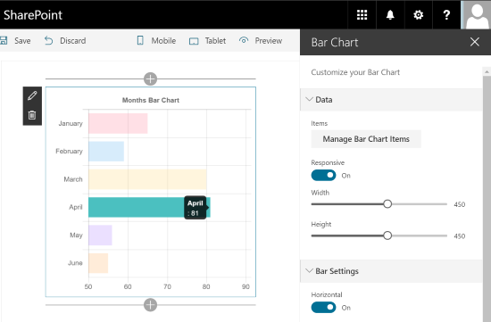 | [**Bar Chart**](https://github.com/OlivierCC/spfx-40-fantastics/wiki/Bar-Chart) |  To generate a chart in the form of a vertical or horizontal diagram. You can simply edit the data of the chart, change the values, labels, or colors. Create simply and effectively elegant and effective dashboards for your employees.
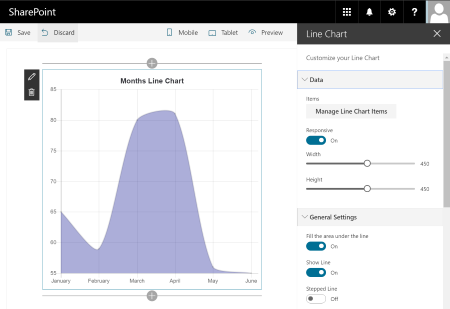 | [**Line Chart**](https://github.com/OlivierCC/spfx-40-fantastics/wiki/Line-Chart) | A simple and effective Web Part to generate a line chart in a page. You can choose the points on the line, set the line and fill, color, etc. Convenient to view financial results for example.
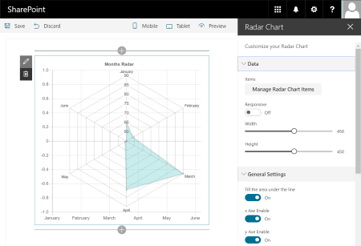 | [**Radar Chart**](https://github.com/OlivierCC/spfx-40-fantastics/wiki/Radar-Chart) |  Offer elegant and alternative views to your data with this Web part. With the radar chart, you can for example easily see comparisons between data.
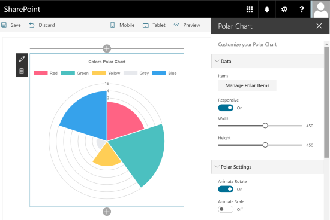 | [**Polar Chart**](https://github.com/OlivierCC/spfx-40-fantastics/wiki/Polar-Chart) |  A web part to insert a polar chart, modify the data and the render. Very easy & quick to use in a SharePoint page.

## Images Galleries & Tools

Overview |  Web Part |  Description
------------ | ----------- | -----------
 | [**Tiles Gallery**](https://github.com/OlivierCC/spfx-40-fantastics/wiki/Tiles-Gallery) |  From any library of images of your SharePoint site, generate a gallery of pictures in tiles mode. You can click on the images to open them in a web viewer in lightbox view. You can choose the appearance of your tiles, colors, texts, width, height, etc. Your tiles could be justified (classical tiles mode) or vertical (like Delve dashboard).
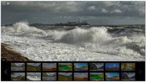 | [**Grid Gallery**](https://github.com/OlivierCC/spfx-40-fantastics/wiki/Grid-Gallery) | From any library of images of your SharePoint site, you can generate an image gallery with thumbnails that scroll automatically. You can click on an image to enlarge. This Web Pat is responsive.
 | [**Photopile**](https://github.com/OlivierCC/spfx-40-fantastics/wiki/Photopile) | From a SharePoint library, this Web Part generates a stack of photos on a table effect. This gives an aspect of photo gallery of Polaroid, for example. Click on the photos to enlarge to full screen.
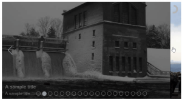 | [**Slider Gallery**](https://github.com/OlivierCC/spfx-40-fantastics/wiki/Slider-Gallery) | This Web Part allows you to view your photo galleries in the form of a slider between the images. Photos automatically scroll with the effect of your choice. The user can click on the arrows or use the touch features to navigate through the images. On click, the image is opened in full screen.
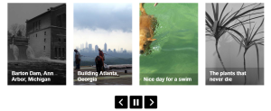 | [**Simple Carousel**](https://github.com/OlivierCC/spfx-40-fantastics/wiki/Simple-Carousel) | The Web Part Simple Carousel allows you to browse a library of images in forms of thumbnails that scroll horizontally.
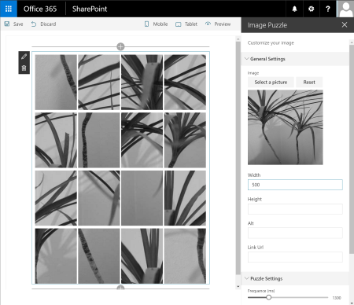 | [**Image Puzzle**](https://github.com/OlivierCC/spfx-40-fantastics/wiki/Image-Puzzle) |  From an image of your SharePoint site, this Web Part will generate a puzzle effect. The image will be automatically cut into pieces, and the pieces are going to move next to the other before returning to the normal state of the image. Nice to add style to your page.
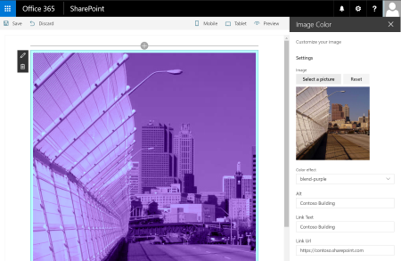 | [**Image Color**](https://github.com/OlivierCC/spfx-40-fantastics/wiki/Image-Color) | This Web Part allows you to select an image and automatically apply a color effect. This Web Part uses libraries of CSS3 effects to color images.

## Video & Audio

Overview |  Web Part |  Description
------------ | ----------- | -----------
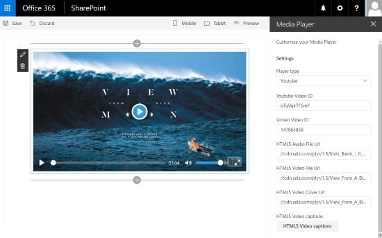 | [**Media Player**](https://github.com/OlivierCC/spfx-40-fantastics/wiki/Media-Player) |  This Web Part is an alternative player for videos or audio files. This player allows you to play video files in HTML5 mode, with streamed videos to different formats and also from Youtube or Vimeo. This player is elegant and also lets you add subtitles to videos in different languages.
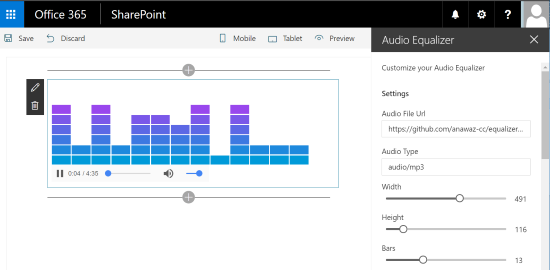 | [**Audio Equalizer**](https://github.com/OlivierCC/spfx-40-fantastics/wiki/Audio-Equalizer) |  Instead of the classic audio player, you can use a fun player with an equalizer. The equalizer adds an effect on music that drives your page and the user experience. You can configure your equalizer by modifying the columns, color, speed, etc.

## Text Tools

Overview |  Web Part |  Description
------------ | ----------- | -----------
 | [**Markdown**](https://github.com/OlivierCC/spfx-40-fantastics/wiki/Markdown) | If you like the Markdown (MD) syntax, this Web Part is made for you! With this Web Part, you can add a player of Markdown in your page and edit its content through a specialized Editor. It has never been as easy to use the power of Markdown in SharePoint.
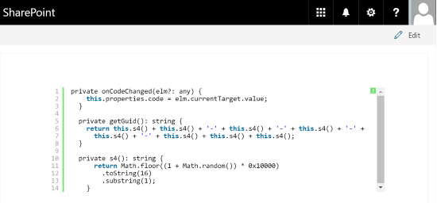 | [**Syntax Highlighter**](https://github.com/OlivierCC/spfx-40-fantastics/wiki/Syntax-Highlighter) | With this Web Part, you can copy and paste the code in a page and automatically benefit from a syntax highlighter to read the code. This Web Part supports many languages as ActionScript3, Bash/shell, ColdFusion, c#, C++, CSS, Delphi, Diff, Erlang, Groovy, JavaScript, Java, JavaFX, Perl, PHP, Plain Text, PowerShell, Python, Ruby, Scala, SQL, Visual Basic and XML.
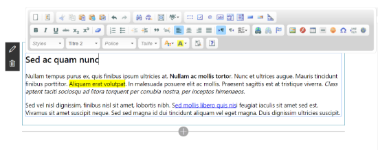 | [**Fck Text**](https://github.com/OlivierCC/spfx-40-fantastics/wiki/Fck-Text) | This Web Part is a simple alternative text editor. Instead of the native SharePoint Editor, this Web Part uses the editor CKEditor, which is a popular and powerful JavaScript full HTML code editor. You can configure the type of integration (fixed or dynamic), or even the type of toolbar to edit your content.
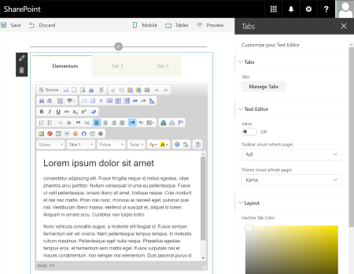 | [**Tabs**](https://github.com/OlivierCC/spfx-40-fantastics/wiki/Tabs) | You can dynamically create sections to view your content in the form of tabs. In edit mode, you can directly modify the contents of each tab with a WYSIWYG editor and preview your Web Part in your page. The tabs are responsives and adapt with the size of the screen.
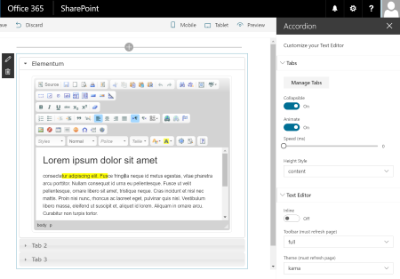 | [**Accordion**](https://github.com/OlivierCC/spfx-40-fantastics/wiki/Accordion) | As for the Web Part of the tabs, you can manage the content in the form of accordion sections. Add, edit or remove your tabs and change the content with the WYSIWYG editor.
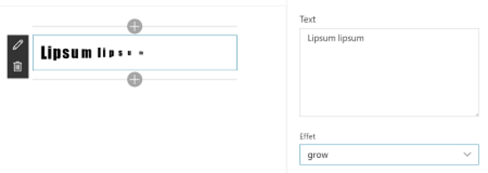 | [**Animated Text**](https://github.com/OlivierCC/spfx-40-fantastics/wiki/Animated-Text) | This Web Part allows you to add a text with an animation. You can choose among a large number of animation (fade, resizing, time, rotation, etc.), choose do it, color, size, etc.
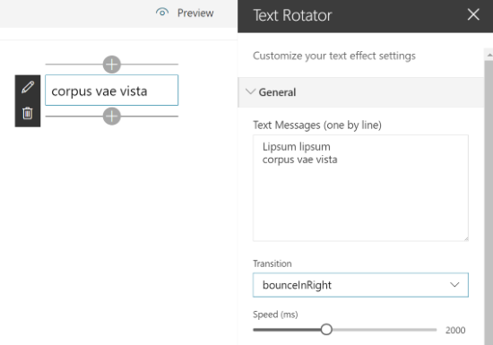 | [**Text Rotator**](https://github.com/OlivierCC/spfx-40-fantastics/wiki/Text-Rotator) | This Web Part allows you to display several sentences one after the other with a transition effect.
 | [**Arc Text**](https://github.com/OlivierCC/spfx-40-fantastics/wiki/ArcText) | With this Web Part, you can add a text with effect of curve. You can editing your title appearance, and choose the degree of the curve.
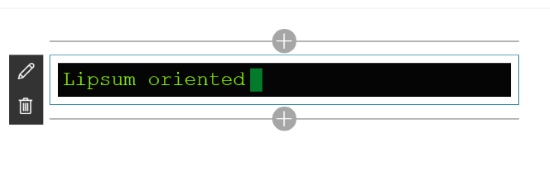 | [**TypeWriting**](https://github.com/OlivierCC/spfx-40-fantastics/wiki/Type-Writing) | Insert a text with a typwriter effect. It will simulate a mechanical or electromechanical machine for writing in characters similar to those produced by printer.

## Tools

Overview |  Web Part |  Description
------------ | ----------- | -----------
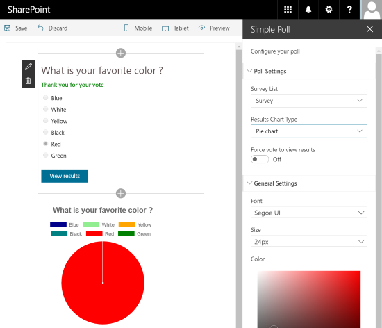 | [**Simple Poll**](https://github.com/OlivierCC/spfx-40-fantastics/wiki/Simple-Poll) | Insert a simple poll (one question) based on a SharePoint survey list. This Web Part is perfect for simple surveys to insert on a homepage for example. Users can vote in 1 click and see the results in the form of a pie or bar chart.
 | [**Bing Translator**](https://github.com/OlivierCC/spfx-40-fantastics/wiki/Bing-Translator) | Insert a Bing Translator widget to automatically translate the current page in another language. This WebPart is going to add to your page a "Translate" button. When user click on this button, it can translate in-place and automatically the content of the page in the language of his choice.
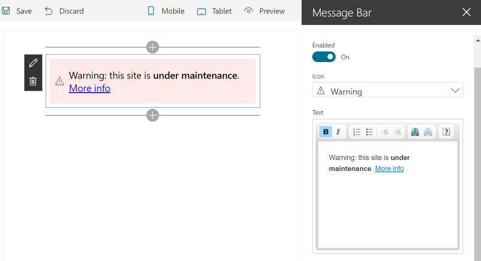 | [**Message Bar**](https://github.com/OlivierCC/spfx-40-fantastics/wiki/Message-Bar) | Insert a message bar to your page, for example set a maintenance warning text, etc. Very convenient to share a simple and highly visible message to your visitors.
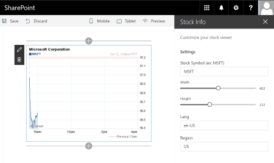 | [**Stock Info**](https://github.com/OlivierCC/spfx-40-fantastics/wiki/Stock-Info) | Generates as graph picture the current stock value of a specified stock. With this Web Part, you can for example share the current stock price of your company on your homepage. This Web Part uses the Yahoo! Financial Services.
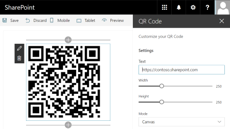 | [**QR Code**](https://github.com/OlivierCC/spfx-40-fantastics/wiki/QR-Code) | Insert a QR Code in your SharePoint pages and modify the associated text, size, etc. A QRCode is very handy for example to allow your users to access simply and quickly to a page on your Intranet from a smartphone.

# Installing the web parts

[Click here to access to the Installation Process](https://github.com/OlivierCC/spfx-40-fantastics/wiki/Installation-process).
You can install and test web parts without compiling the code by following this procedure.

# Building the code

```bash
git clone the repo
npm i
npm i -g gulp
gulp serve
```

Applies to :
* [SharePoint Framework Developer Preview](http://dev.office.com/sharepoint/docs/spfx/sharepoint-framework-overview)
* [Office 365 developer tenant](http://dev.office.com/sharepoint/docs/spfx/set-up-your-developer-tenant)

# Solution

Solution|Author(s)
--------|---------
spfx-40-fantastics | Olivier Carpentier (@olivierc)

# The MIT License (MIT)

Copyright (c) 2016 Olivier Carpentier

Permission is hereby granted, free of charge, to any person obtaining a copy of this software and associated documentation files (the "Software"), to deal in the Software without restriction, including without limitation the rights to use, copy, modify, merge, publish, distribute, sublicense, and/or sell copies of the Software, and to permit persons to whom the Software is furnished to do so, subject to the following conditions:

The above copyright notice and this permission notice shall be included in all copies or substantial portions of the Software.

THE SOFTWARE IS PROVIDED "AS IS", WITHOUT WARRANTY OF ANY KIND, EXPRESS OR IMPLIED, INCLUDING BUT NOT LIMITED TO THE WARRANTIES OF MERCHANTABILITY, FITNESS FOR A PARTICULAR PURPOSE AND NONINFRINGEMENT. IN NO EVENT SHALL THE AUTHORS OR COPYRIGHT HOLDERS BE LIABLE FOR ANY CLAIM, DAMAGES OR OTHER LIABILITY, WHETHER IN AN ACTION OF CONTRACT, TORT OR OTHERWISE, ARISING FROM, OUT OF OR IN CONNECTION WITH THE SOFTWARE OR THE USE OR OTHER DEALINGS IN THE SOFTWARE.
