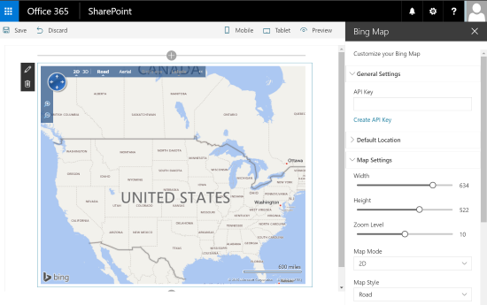

# SPFx 40 Fantastics Web Parts

> Note: The SharePoint Framework is currently in preview and is subject to change. SharePoint Framework client-side web parts are not currently supported for use in production enviornments.

This package is a sample kit of 40 great Client Side Web Parts built on the SharePoint Framework SPFx.
You can find here different kind of high visual web parts as carousel, images galleries, custom editors, polls, charts, map, animations, etc.
These WebParts are mainly based on best-class jQuery, React or Angular plugins and use the [sp-client-custom-fields library](https://github.com/OlivierCC/sp-client-custom-fields) to optimize the edit experience.
Oh, and Yes, these web parts are free and open source, so have fun well to build effective SharePoint site.


## Menu & Carousels & News Management

Overview |  Web Part |  Description
------------ | ----------- | -----------
 | [**3D Carousel**](https://github.com/OlivierCC/spfx-40-fantastics/wiki/3D-Carousel) | Insert a 3D Carousel in your SharePoint pages. With this Web Part, you can manage your menu items and create automatically a 3D carousel.
 | [**Coverflow**](https://github.com/OlivierCC/spfx-40-fantastics/wiki/Coverflow) | Generates a Coverflow Apple like menu in your pages. Manage your menu items with title and picture and create a cool coverflow menu.
 | [**News Carousel**](https://github.com/OlivierCC/spfx-40-fantastics/wiki/News-Carousel) | Insert a classical and responsive cool News Carousel. With this web part, you can add easily news focus in your SharePoint site.
 | [**Tiles Menu**](https://github.com/OlivierCC/spfx-40-fantastics/wiki/Tiles-Menu) | This Web Part allows you to very easily create a menu in form of tiles that is responsive and adapted for mobile. You can directly manage the items on your menu, with a title, an image and manage Visual rendering options.
 | [**News Slider**](https://github.com/OlivierCC/spfx-40-fantastics/wiki/News-Slider) | Insert a News Slider Tiles control to your pages. In a few clicks you can create a slider with buttons allowing you to navigate horizontally in tiles. You can define your elements and customize the look and feel of your slider. This Web Part is responsive.
 | [**News Ticker**](https://github.com/OlivierCC/spfx-40-fantastics/wiki/News-Ticker) | Insert a simple vertical News Ticker to display news as a simple ribbon. This web part is usefull if you want to display Breaking News BBC like information in your site

## Social Tools

Overview |  Web Part |  Description
------------ | ----------- | -----------
 | [**Tweets Feed**](https://github.com/OlivierCC/spfx-40-fantastics/wiki/Tweets-Feed) |  A web part to insert twitter feed from a specified account in a SharePoint page.
 | [**Social Share**](https://github.com/OlivierCC/spfx-40-fantastics/wiki/Social-Share) |  A web part to insert social share buttons as Yammer, Linkedin, Twitter, Facebook and more than 100 other social providers thanks to the Addthis services.
 | [**RSS Reader**](https://github.com/OlivierCC/spfx-40-fantastics/wiki/Rss-Reader) |  A web part to insert a full client side RSS/Atom Feed in your SharePoint pages.
 | [**Social Photo Stream**](https://github.com/OlivierCC/spfx-40-fantastics/wiki/Social-Photo-Stream) |  A web part to insert a list of photo from populars photos sharing plateforms as Instagram, Pinterest, Flickr, Deviantart, Dribbble, Picasa, Youtube & Newsfeed.

## Maps, Charts & Graphs

Overview |  Web Part |  Description
------------ | ----------- | -----------
 | [**Bing Map**](https://github.com/OlivierCC/spfx-40-fantastics/wiki/Bing-Map) |  A web part to insert an interactive map built with Bing Map Services in your pages.
 | [**Vertical Timeline**](https://github.com/OlivierCC/spfx-40-fantastics/wiki/Vertical-Timeline) |  A web part to generate a Facebook like vertical Timeline from SharePoint Calendar list items.
 | [**Pie Chart**](https://github.com/OlivierCC/spfx-40-fantastics/wiki/Pie-Chart) |  A web part to insert a pie chart, modify the data and the render. Very easy & quick to use in a SharePoint page.
 | [**Bar Chart**](https://github.com/OlivierCC/spfx-40-fantastics/wiki/Bar-Chart) |  A web part to insert a bar chart, modify the data and the render. Very easy & quick to use in a SharePoint page.
 | [**Polar Chart**](https://github.com/OlivierCC/spfx-40-fantastics/wiki/Polar-Chart) |  A web part to insert a polar chart, modify the data and the render. Very easy & quick to use in a SharePoint page.
 | [**Line Chart**](https://github.com/OlivierCC/spfx-40-fantastics/wiki/Line-Chart) |  A web part to insert a line chart, modify the data and the render. Very easy & quick to use in a SharePoint page.
 | [**Radar Chart**](https://github.com/OlivierCC/spfx-40-fantastics/wiki/Radar-Chart) |  A web part to insert a radar chart, modify the data and the render. Very easy & quick to use in a SharePoint page.

## Images Galleries & Tools

Overview |  Web Part |  Description
------------ | ----------- | -----------
 | [**Tiles Gallery**](https://github.com/OlivierCC/spfx-40-fantastics/wiki/Tiles-Gallery) |  Generate a Tiles pictures gallery from a SharePoint pictures library
 | [**Slider Gallery**](https://github.com/OlivierCC/spfx-40-fantastics/wiki/Slider-Gallery) | Insert a pictures slider with navigation from a SharePoint pictures library
 | [**Simple Carousel**](https://github.com/OlivierCC/spfx-40-fantastics/wiki/Simple-Carousel) | Insert a pictures carousel from a SharePoint pictures library
 | [**Grid Gallery**](https://github.com/OlivierCC/spfx-40-fantastics/wiki/Grid-Gallery) | Insert a pictures gallery with a grid panel from a SharePoint pictures library
 | [**Photopile**](https://github.com/OlivierCC/spfx-40-fantastics/wiki/Photopile) | Generate a pile of photos from a SharePoint pictures library
 | [**Image Color**](https://github.com/OlivierCC/spfx-40-fantastics/wiki/Image-Color) |  A web part to insert a picture and choose a color effect to apply on it.
 | [**Image Puzzle**](https://github.com/OlivierCC/spfx-40-fantastics/wiki/Image-Puzzle) |  A web part to insert a picture and add a puzzle split animation.

## Video & Audio

Overview |  Web Part |  Description
------------ | ----------- | -----------
 | [**Media Player**](https://github.com/OlivierCC/spfx-40-fantastics/wiki/Media-Player) |  Insert a smart media player in your page with support of HTML 5 Audio & Video, Youtube and Vimeo
 | [**Audio Equalizer**](https://github.com/OlivierCC/spfx-40-fantastics/wiki/Audio-Equalizer) |  Insert a html5 audio player with an pure JavaScript equalizer animation

## Text Tools

Overview |  Web Part |  Description
------------ | ----------- | -----------
 | [**Markdown**](https://github.com/OlivierCC/spfx-40-fantastics/wiki/Markdown) | Insert a text with a Markdown (MD) editor & markdown syntax
 | [**Syntax Highlighter**](https://github.com/OlivierCC/spfx-40-fantastics/wiki/Syntax-Highlighter) | Insert a web part to display code with automatic syntax highlighter (Js, C#, VB, etc.)
 | [**Fck Text**](https://github.com/OlivierCC/spfx-40-fantastics/wiki/Fck-Text) | Insert text in your pages and edit it with the popular FCK Editor
 | [**Tabs**](https://github.com/OlivierCC/spfx-40-fantastics/wiki/Tabs) | Insert a responsive and dynamic Tabs and edit the content of each tab with WYSIWYG editor
 | [**Accordion**](https://github.com/OlivierCC/spfx-40-fantastics/wiki/Accordion) | Insert an accordion and manage dynamically the tabs and the content thanks to the WYSIWYG editor
 | [**Animated Text**](https://github.com/OlivierCC/spfx-40-fantastics/wiki/AnimatedText) | Insert a text with an effect as fade, swing, etc.
 | [**Text Rotator**](https://github.com/OlivierCC/spfx-40-fantastics/wiki/Text-Rotator) | Automatic rotator between text messages with a transition effect
 | [**Arc Text**](https://github.com/OlivierCC/spfx-40-fantastics/wiki/ArcText) | Insert a curved text in your SharePoint pages
 | [**TypeWriting**](https://github.com/OlivierCC/spfx-40-fantastics/wiki/Type-Writing) | Insert a text with a type writing effect

## Tools

Overview |  Web Part |  Description
------------ | ----------- | -----------
 | [**Simple Poll**](https://github.com/OlivierCC/spfx-40-fantastics/wiki/Simple-Poll) | Insert a simple poll (one question) based on a SharePoint survey list. This Web Part is perfect for simple surveys to insert on a homepage for example. Users can vote in 1 click and see the results in the form of a pie or bar chart.
 | [**Bing Translator**](https://github.com/OlivierCC/spfx-40-fantastics/wiki/Bing-Translator) | Insert a Bing Translator widget to automatically translate the current page in another language.
 | [**Message Bar**](https://github.com/OlivierCC/spfx-40-fantastics/wiki/Message-Bar) | Insert a message bar to your page, for example set a maintenance warning text, etc.
 | [**Stock Info**](https://github.com/OlivierCC/spfx-40-fantastics/wiki/Stock-Info) | Generates as graph picture the current stock value of a specified stock.
 | [**QR Code**](https://github.com/OlivierCC/spfx-40-fantastics/wiki/QR-Code) | Insert a QR Code in your SharePoint pages and modify the associated text, size, etc.

## Building the code

```bash
git clone the repo
npm i
npm i -g gulp
gulp serve
```

Applies to :
* [SharePoint Framework Developer Preview](http://dev.office.com/sharepoint/docs/spfx/sharepoint-framework-overview)
* [Office 365 developer tenant](http://dev.office.com/sharepoint/docs/spfx/set-up-your-developer-tenant)

## Solution

Solution|Author(s)
--------|---------
spfx-40-fantastics | Olivier Carpentier (@olivierc)

# The MIT License (MIT)

Copyright (c) 2016 Olivier Carpentier

Permission is hereby granted, free of charge, to any person obtaining a copy of this software and associated documentation files (the "Software"), to deal in the Software without restriction, including without limitation the rights to use, copy, modify, merge, publish, distribute, sublicense, and/or sell copies of the Software, and to permit persons to whom the Software is furnished to do so, subject to the following conditions:

The above copyright notice and this permission notice shall be included in all copies or substantial portions of the Software.

THE SOFTWARE IS PROVIDED "AS IS", WITHOUT WARRANTY OF ANY KIND, EXPRESS OR IMPLIED, INCLUDING BUT NOT LIMITED TO THE WARRANTIES OF MERCHANTABILITY, FITNESS FOR A PARTICULAR PURPOSE AND NONINFRINGEMENT. IN NO EVENT SHALL THE AUTHORS OR COPYRIGHT HOLDERS BE LIABLE FOR ANY CLAIM, DAMAGES OR OTHER LIABILITY, WHETHER IN AN ACTION OF CONTRACT, TORT OR OTHERWISE, ARISING FROM, OUT OF OR IN CONNECTION WITH THE SOFTWARE OR THE USE OR OTHER DEALINGS IN THE SOFTWARE.
