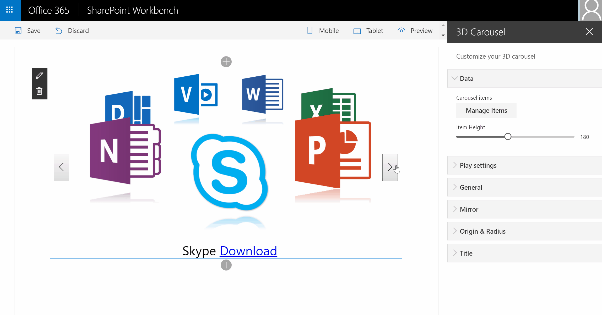
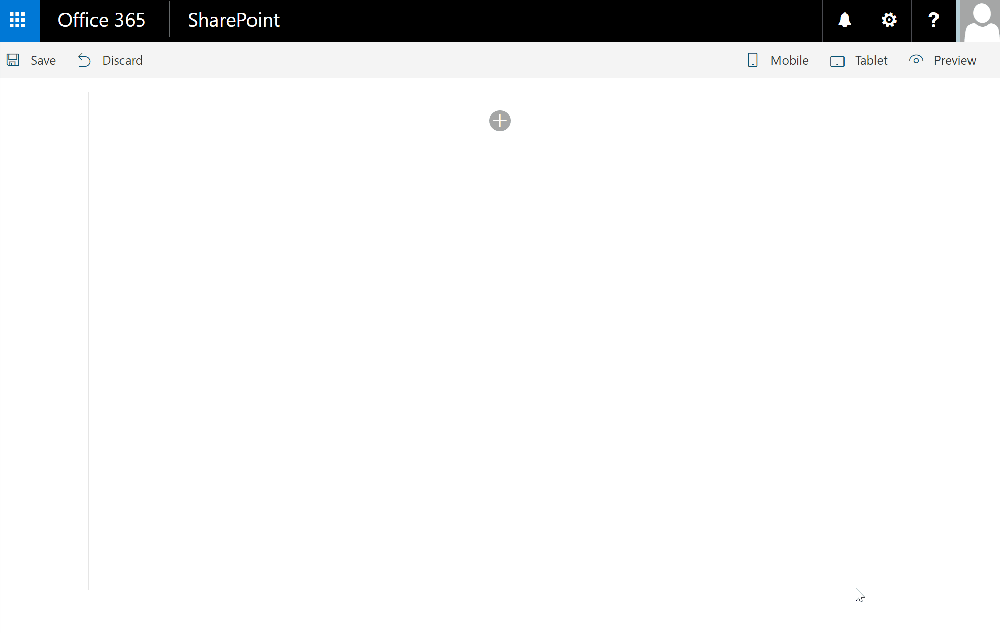
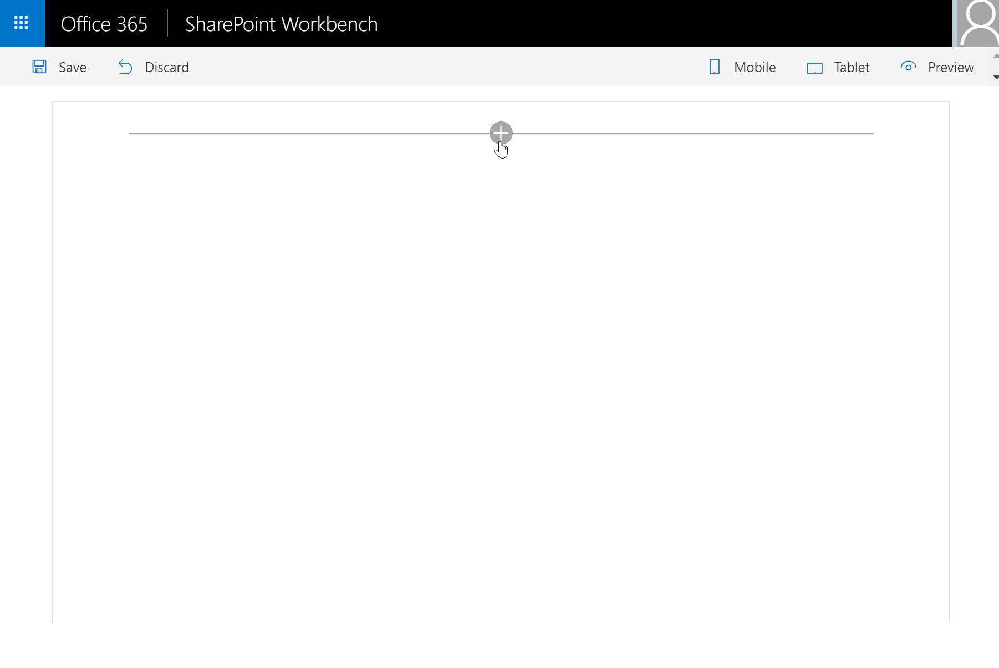

# SPFx 40 Fantastics Web Parts

This package is a sample kit of great Client Side Web Parts built on the SharePoint Framework SPFx.
You can find here different kind of high visual web parts as carousel, images galleries, etc.

> Note: The SharePoint Framework is currently in preview and is subject to change. SharePoint Framework client-side web parts are not currently supported for use in production enviornments.

You can find here the following web parts:

Overview |  Web Part |  Description
------------ | ----------- | -----------
 | **3D Carousel** | Insert a 3D Carousel in your SharePoint pages
 | **Tiles Gallery** |  Generate a Tiles pictures gallery from a SharePoint pictures library
 | **Slider Gallery** | Insert a pictures slider with navigation from a SharePoint pictures library
 | **Simple Carousel** | Insert a pictures carousel from a SharePoint pictures library
 | **Grid Gallery** | Insert a pictures gallery with a grid panel from a SharePoint pictures library
 | **Photopile** | Generate a pile of photos from a SharePoint pictures library
 | **ArcText** | Insert a curved text in your SharePoint pages

## Building the code

```bash
git clone the repo
npm i
npm i -g gulp
gulp
```

# 3D Carousel Web Part

The 3D Carousel Web Part is a SharePoint client side web part built with the SharePoint Framework (SPFx) in the preview version.
This web part adds a 3D carousel animation with picture, title and link.
This project uses the JQuery plugin [jquery.cloud9carousel.js](http://specious.github.io/cloud9carousel/) created by R. Cecco.
This web part uses also the [Custom Fields library](https://github.com/OlivierCC/sp-client-custom-fields) to enhance the web part edition experience.

Thanks to this WP, you can insert your text, change the radius, the direction, the size, the font, etc.
Your title has now an awesome look.



### Features

You can configure the following Web Part settings:
* **Manage items**: Collection of carousel items. An item is composed of a Title (mnandatory), a Picture Url (mandatory), a boolean to indicate if the
item is enabled or disabled, a link url (optional) and a link text (optional).
* **Item Height**: Carousel item height in pixels (default 180)
* **Speed**: Relative speed factor of the carousel. Any positive number: 1 is slow, 4 is medium, 10 is fast. Adjust to your liking
* **Autoplay**: Automatically rotate the carousel by this many items periodically. Auto-play is not performed while the mouse hovers over the carousel container (default is true).
* **Autoplay delay**: Delay, in milliseconds, between auto-play spins (default is 4000)
* **Height**: Carousel container's height in pixels (default is 400)
* **Show Title**: Indicates if the title is displayed or not (default is true)
* **Show Buttons**:Indicates if the buttons are displayed or not (default is true)
* **Bring to Front**: Indicates if clicking an item will rotate it to the front (default is true)
* **Mirror Gap**: Vertical gap in pixels between the bottom of the item (at full size) and the top of its reflection (default is 2)
* **Mirror Height**: The height of the reflection relative to the height of the item (range: 0 to 1) (default is 0.2)
* **Mirror Opacity**: Opacity of the reflection at its top (most visible part) (range: 0 to 1) (default is 0.4)
* **Y Origin**: Center of the carousel (y coordinate)
* **Y Radisu**: Half the height of the carousel
* **X Origin**: Center of the carousel (x coordinate)
* **X Radisu**: Half the width of the carousel
* **Title Font**: specifies the Title font family as Arial, Verdana, etc.
* **Title Size**: sets the Title font size
* **Title Color**: sets the Title font color

# Tiles Images Gallery Web Part

The tiles gallery renders a dynamic images gallery as titles. This web part implements [unitegallery.js](https://github.com/vvvmax/unitegallery/)
(a popular jquery script) as a client side web part for SharePoint. This web part is able to query a SharePoint Picture Library to find the images and render it as a tiles gallery.



### Features

You can configure the following Web Part settings:
* **Query**: you must select a current web picture library and select order by conditions
* **Justified**: indicates if the tiles are justified or not
* **Enable Icons**: enable icons in mouseover mode
* **Enable Shadow**: enable shadow of the tile
* **Enable Border**: enable border of the tile
* **Space Between Cols**: space between images
* **Border Color**: tile border color
* **Border**: tile border width
* **Text Panel Enable**: enable textpanel
* **Text Panel Always On Top**: textpanel always visible
* **Text Panel Position**: inside_bottom, inside_top, inside_center, top, bottom the position of the textpanel
* **Text Panel Opacity**: textpanel background opacity
* **Text Panel Font**: textpanel title font family. if null - take from css
* **Text Panel Font Size**: textpanel title font size. if null - take from css
* **Text Panel Font Color**: textpanel title color. if null - take from css
* **Text Panel Background Color**: textpanel background color
* **Text Panel Align**: textpanel title text align. if null - take from css


# Slider Images Gallery Web Part

The slider gallery renders a dynamic slider on images. This web part implements [unitegallery.js](https://github.com/vvvmax/unitegallery/)
(a popular jquery script) as a client side web part for SharePoint.
This web part is able to query a SharePoint Picture Library to find the images and render it as a slider gallery.


### Features

You can configure the following Web Part settings:
* **Query**: you must select a current web picture library and select order by conditions
* **Enable Arrows**: enable arrows onslider element
* **Enable Bullets**: enable the bullets onslider element
* **Enable Play Button**: true,false - enable play / pause button onslider element
* **Enable Fullscreen Button**: true,false - enable fullscreen button onslider element
* **Enable Zoom Panel**: true,false - enable the zoom buttons, works together with zoom control.
* **Controls Always On**: true,false - controls are always on, false - show only on mouseover
* **Preserve Ratio**: true, false - preserver ratio when on window resize
* **Pause On Mouseover**: true,false - pause on mouseover when playing slideshow true/false
* **Carousel**: true,false - next button on last image goes to first image.
* **Autoplay**: true / false - begin slideshow autoplay on start
* **Speed**: play interval of the slideshow
* **Transition**: fade, slide - the transition of the slide change
* **Enable Progress Indicator**: enable progress indicator element
* **Text Panel Enable**: enable textpanel
* **Text Panel Always On Top**: textpanel always visible
* **Text Panel Opacity**: textpanel background opacity
* **Text Panel Font**: textpanel title font family. if null - take from css
* **Text Panel Font Size**: textpanel title font size. if null - take from css
* **Text Panel Font Color**: textpanel title color. if null - take from css
* **Text Panel Background Color**: textpanel background color
* **Text Panel Align**: textpanel title text align. if null - take from css

# Simple Carousel Web Part

The simple carousel Web Part renders a simple images pixs slideshow. This web part implements [unitegallery.js](https://github.com/vvvmax/unitegallery/)
(a popular jquery script) as a client side web part for SharePoint.
This web part is able to query a SharePoint Picture Library to find the images and render it as a carousel.


### Features

You can configure the following Web Part settings:
* **Query**: you must select a current web picture library and select order by conditions
* **Enable Arrows**: enable arrows onslider element
* **Enable Icons**: enable icons in mouseover mode
* **Enable Border**: enable border of the tile
* **Tile Width**: tile width
* **Tile Height**: tile height
* **Border Color**: tile border color
* **Border**: tile border width
* **Pause On Mouseover**: true,false - pause on mouseover when playing slideshow true/false
* **Autoplay**: true / false - begin slideshow autoplay on start
* **Speed**: play interval of the slideshow
* **Text Panel Enable**: enable textpanel
* **Text Panel Always On Top**: textpanel always visible
* **Text Panel Opacity**: textpanel background opacity
* **Text Panel Font**: textpanel title font family. if null - take from css
* **Text Panel Font Size**: textpanel title font size. if null - take from css
* **Text Panel Font Color**: textpanel title color. if null - take from css
* **Text Panel Background Color**: textpanel background color


# Grid Gallery Web Part

The grid gallery Web Part renders a pictures slideshow with grid of thumbnails.
This web part implements [unitegallery.js](https://github.com/vvvmax/unitegallery/)
(a popular jquery script) as a client side web part for SharePoint.
This web part is able to query a SharePoint Picture Library to find the images and render it as a carousel.


### Features

You can configure the following Web Part settings:
* **Query**: you must select a current web picture library and select order by conditions
* **Enable Arrows**: enable arrows onslider element
* **Enable Bullets**: enable the bullets onslider element
* **Enable Play Button**: true,false - enable play / pause button onslider element
* **Enable Fullscreen Button**: true,false - enable fullscreen button onslider element
* **Enable Zoom Panel**: true,false - enable the zoom buttons, works together with zoom control.
* **Controls Always On**: true,false - controls are always on, false - show only on mouseover
* **Preserve Ratio**: true, false - preserver ratio when on window resize
* **Enable Border**: enable border of the tile
* **Tile Width**: tile width
* **Tile Height**: tile height
* **Border Color**: tile border color
* **Border**: tile border width
* **Pause On Mouseover**: true,false - pause on mouseover when playing slideshow true/false
* **Autoplay**: true / false - begin slideshow autoplay on start
* **Speed**: play interval of the slideshow
* **Text Panel Enable**: enable textpanel
* **Text Panel Always On Top**: textpanel always visible
* **Text Panel Opacity**: textpanel background opacity
* **Text Panel Font**: textpanel title font family. if null - take from css
* **Text Panel Font Size**: textpanel title font size. if null - take from css
* **Text Panel Font Color**: textpanel title color. if null - take from css
* **Text Panel Background Color**: textpanel background color

# Photopile Web Part

The photopile-web-part project is a SharePoint web part built using the SharePoint Framework (SPFx) in the preview version.
This project implements the great [Photopile.Js](https://github.com/bigbhowell/Photopile-JS) created by Brian W. Howell
(a popular jquery script) as a client side web part for SharePoint.

With this Web Part, you can display the photos contained in a SharePoint Pictures Library as a cool image gallery that
simulates a pile of photos scattered about on a surface. Thumbnail clicks remove photos from the pile,
(enlarging them as if being picked up by the user), and once in  view a secondary click returns the photo to the pile.


### Features

This web part uses React, Office UI Fabric, JQuery, JQuery UI and Photopile.js. This web part is available in English (en-us)
and French (fr-fr). You can use this web part with SharePoint Online (Office 365) or SharePoint Server 2016.

It is able to:
* List Picture Libs contained in the current SharePoint web site
* List all the pictures in the selected List
* Render the pics as a cool photopile
* Personalize the layout thanks to editable settings

If you are a SharePoint web developer, you can be interested by the following code patterns :
* Include JQuery and external framework in your solution
* Implement rich web part properties panel with controls like DropDown, Sliders, Toggle, etc.
* Load dynamic data from SharePoint as web part properties
* Load dynamic data from SharePoint REST Services, as lists or items
* Implement mock system to test your solution in the local workbench or on a SharePoint site
* Include Office UI Fabric controls in your project
* Render content with React
* Etc.


# ArcText Web Part

The ArcText Web Part is a SharePoint client side web part built with the SharePoint Framework (SPFx) in the preview version.
This web part adds a curved text effect to your titles.
This project uses the JQuery plugin [jquery.arctext.js](https://github.com/codrops/Arctext) created by Pedro Botelho.
This web part uses also the [Custom Fields library](https://github.com/OlivierCC/sp-client-custom-fields) to enhance the web part edition experience.

Thanks to this WP, you can insert your text, change the radius, the direction, the size, the font, etc.
Your title has now an awesome look.



### Features

You can manage the following settings:
* **Text**: sets your text
* **Radius**: specifies the radius
* **Rotate Letters**: indicates if the letters must rotate or stay vertical
* **Reverse**: reverses the curved effect
* **Align**: aligns text on left, center or right
* **Font**: specifies the font family as Arial, Verdana, etc.
* **Size**: sets the font size
* **Color**: sets the font color

# The MIT License (MIT)

Copyright (c) 2016 Olivier Carpentier

Permission is hereby granted, free of charge, to any person obtaining a copy of this software and associated documentation files (the "Software"), to deal in the Software without restriction, including without limitation the rights to use, copy, modify, merge, publish, distribute, sublicense, and/or sell copies of the Software, and to permit persons to whom the Software is furnished to do so, subject to the following conditions:

The above copyright notice and this permission notice shall be included in all copies or substantial portions of the Software.

THE SOFTWARE IS PROVIDED "AS IS", WITHOUT WARRANTY OF ANY KIND, EXPRESS OR IMPLIED, INCLUDING BUT NOT LIMITED TO THE WARRANTIES OF MERCHANTABILITY, FITNESS FOR A PARTICULAR PURPOSE AND NONINFRINGEMENT. IN NO EVENT SHALL THE AUTHORS OR COPYRIGHT HOLDERS BE LIABLE FOR ANY CLAIM, DAMAGES OR OTHER LIABILITY, WHETHER IN AN ACTION OF CONTRACT, TORT OR OTHERWISE, ARISING FROM, OUT OF OR IN CONNECTION WITH THE SOFTWARE OR THE USE OR OTHER DEALINGS IN THE SOFTWARE.
